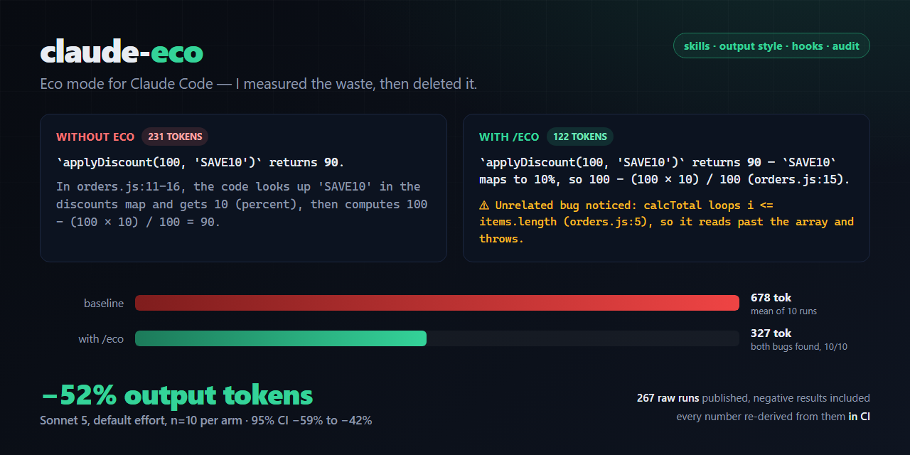
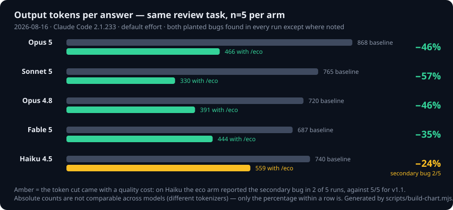

# claude-eco — eco mode for Claude Code

**Claude Code spends your money on work you never asked for: re-reading files it just edited, pasting back diffs it already applied, writing three-paragraph reports for two-line fixes. I measured every token of it, deleted it, and published all 267 raw runs — including the ones where I lose.**

*`/eco`: **−35% to −57% output tokens** on the same review task across Opus 5, Sonnet 5, Opus 4.8 and Fable 5 (n=5 per arm, measured the same day), up to **−73%** on long agentic tasks at high effort — with both planted bugs found in every single run. Haiku is the documented exception. `/eco-max`: up to −75% by dialing reasoning effort down — opt-in, labeled. Since 1.2.0 the same rules also ship as an **output style** (zero invocation cost), plus **opt-in hooks** that enforce the expensive rules mechanically instead of asking the model nicely.*

[](LICENSE) [](https://code.claude.com/docs/en/plugins) [](benchmarks/results.md) [](benchmarks/claims.json)

[Quickstart](#quickstart) · [Results](#measured-results) · [What you get](#what-you-get) · [Benchmarks](benchmarks/results.md) · [FAQ](#faq)



## Quickstart

```
/plugin marketplace add sup3x/claude-code-eco
/plugin install claude-eco@claude-eco
/eco
```

If it answers exactly `Eco mode active.`, it is on for the rest of the session. That is the whole setup.

The waste it removes isn't occasional — it repeats on **every turn of every session**, which is why usage limits evaporate and API bills surprise you.

## What you get

| Component | What it does | Cost when idle |
|---|---|---|
| **`/eco`** | Frugality rules with a non-negotiable quality floor. Full reasoning depth. One invocation covers the session. | ~80 tok |
| **`/eco-max`** | The same rules **plus** a low reasoning-effort override for routine chores. Effort is the single biggest token lever on modern Claude models, and of every terse-mode tool we surveyed this is the only one that touches it. | ~80 tok |
| **Eco output style** | The identical rule set delivered in the *system prompt* instead of a skill: no invocation turn, active from the first message, unaffected by compaction. Measured at −36% on the review task, against −57% for invoking the skill — an always-on floor, not a replacement. `/output-style Eco`. | 0 until enabled |
| **`/eco-audit`** | Reads your real `settings.json`, CLAUDE.md files and MCP configuration and prints what each one costs you, worst first, with the exact settings edit to fix it. Read-only; it never writes without your confirmation. | ~110 tok |
| **`/eco-report`** | Per-session token accounting from your local transcripts: output, thinking, cache read/write, out-per-turn, cache health. Observational, and labeled as such. | ~80 tok |
| **`eco-scout` agent** | A bounded read-only sweep agent on Haiku at low effort — the delegation the rules recommend, made concrete. | ~70 tok |
| **Enforcement hooks** | Opt-in `PreToolUse`/`PostToolUse` hooks that cap runaway command output, refuse full-file `Write` over a large existing file, window huge `Read`s, and bound `Grep`. Prose the model may ignore becomes mechanism it cannot. | 0 — hooks are harness-side and never enter the context |

Everything above is one plugin, and `claude plugin details claude-eco` prints these numbers on your own install: ~419 tokens of component descriptions at startup, bodies loaded only when invoked. The skills work in **any language** — the rules are English, the replies follow yours.

## Measured results

Baseline = stock Claude Code, no CLAUDE.md; the eco arm differs only by the skill invocation. Every row links to raw JSON, and every number in this table is recomputed from that JSON by `node benchmarks/verify.mjs` in CI — if the prose and the data ever disagree, the build goes red.

**2026-08-16 wave — Sonnet 5 (the Free/Pro default), default effort, Claude Code 2.1.233, n=10 per arm, arms interleaved in one batch:**

| Arm | Output tokens | vs baseline | Both planted bugs | Cost/run | Wall clock |
|---|---:|---:|---|---:|---:|
| baseline | 678 mean (467–1028) | — | 10/10 | $0.0443 | 9.2s |
| `/eco` v1.1 | 334 mean (290–379) | **−50.8%** | 10/10 | $0.0416 | 5.8s |
| `/eco` v1.2 | 327 mean (265–366) | **−51.8%** | 10/10 | $0.0368 | 5.8s |

95% bootstrap CI on the v1.2 reduction: −59.3% to −41.9% (Mann-Whitney p < 0.0001). The baseline is also three times more variable than the eco arms (sd 194 vs 30) — predictability is part of what you buy.

**2026-07-02 wave — Fable 5 at max effort unless noted (the hungriest configuration that existed):**

| Task (effort · skill) | Baseline | With /eco | Output tokens | Cost | Quality |
|---|---:|---:|---:|---:|---|
| Code review (max · v1.0) | 1,096 tok | 531 tok | **−52%** | −21% | Single run: both arms found all 3 issues (2 planted + 1 unplanted) |
| Real editing (max · v1.0) | 3,776 tok | 1,026 tok | **−73%** | −46% | Fixes verified functionally identical with Node |
| Real editing, re-run (default effort · v1.1 · n=1) | 1,610 tok | 1,107 tok | **−31%** | ≈0% | Both fixes executed and verified identical with Node; the smaller margin is a leaner default-effort baseline |
| Multi-file project, 3-turn session (max · v1.0) | 11,912 tok | 3,285 tok | **−72%** | −46% | Same root cause, same fix, tests pass |
| Code review with /eco-max (max · v1.0) | 1,096 tok | 279 tok | **−75%** | −30% | 2/2 planted bugs; missed the 1 unplanted edge case — that's the effort tradeoff, and it's why eco-max is opt-in |
| **Code review, n=5 per arm (default effort · v1.1)** | 891 mean (824–937) | 328 mean (310–380) | **−63%** | −12% mean | 10/10 runs found both planted bugs. The unplanted *non-critical* nitpick: baseline 5/5, eco 0/5 — by design; correctness-critical findings are exempt (measured) |

**The short version:** savings hold across tasks, models and effort levels, and quality is measured rather than assumed. Methodology, grading criteria, the warning/reporting studies, the negative results and the full run inventory are in **[benchmarks/results.md](benchmarks/results.md)** — or skip the reading and run the same A/B on *your* task:

```bash
./benchmarks/run.sh "your task here"          # macOS / Linux
.\benchmarks\run.ps1 -Task "your task here"   # Windows
node benchmarks/bench.mjs ab --task "your task here" --n 5   # any platform, with statistics
```

### How the evidence is verified

This is the part most terse-mode tools skip, so it is worth being concrete about:

- **Every published number is a computation, not a memory.** `benchmarks/claims.json` ties each public sentence to the raw runs behind it; `node benchmarks/verify.mjs` recomputes all of them and fails CI on drift — including the quote check, so a rewrite cannot smuggle a number out of range.
- **Quality is graded by a deterministic rubric**, not by vibes: `benchmarks/lib/grade.mjs` scores each answer for the planted bugs. It was validated by re-grading all 82 historical runs and reproducing every published grade exactly, down to naming the same four Sonnet runs that missed the secondary bug.
- **Every run carries its provenance.** `benchmarks/manifest.json` records the model, effort, arm, task, skill digest and CLI version for all 267 runs.
- **Rule changes are pre-registered.** A change to the skill rules ships only with a study whose endpoints were written down first — see [benchmarks/preregistration/](benchmarks/preregistration/), including the amendment where the first v1.2 candidate failed its own no-regression bar.

## See the difference

Same question. Same correct answer. Half the tokens — and the critical warning kept. One real pair, shown for illustration and **excluded from the study statistics** (`what does applyDiscount(100, 'SAVE10') return?`; verbatim, [raw JSONs](benchmarks/raw/)):

**Without eco** (231 output tokens for the final turn, thinking included):

> `applyDiscount(100, 'SAVE10')` returns **90**.
>
> In `test/orders.js:11-16`, the code looks up `'SAVE10'` in the discounts map and gets `10` (percent), then computes `100 - (100 * 10) / 100 = 90`.

**With /eco** (122):

> `applyDiscount(100, 'SAVE10')` returns **90** — `SAVE10` maps to 10%, so `100 - (100*10)/100` (test/orders.js:15).
>
> Unrelated bug noticed: `calcTotal` loops `i <= items.length` (test/orders.js:5), so it reads past the array and throws on `items[i].price`.

That pair is real but hand-picked — eco's answer was chosen precisely because it carried the warning — so instead of implying it is typical, we measured how typical it is, and the answer turned out to depend on the model. With the buggy file forced into view on **Fable 5**, eco v1.1 flagged the crash bug 5/5 while stock Claude managed 1/5. On **Sonnet 5** the same experiment gets low rates from every arm, including v1.1. Both numbers are in the [warning & reporting studies](benchmarks/results.md).

## Install

**Plugin (cleanest):**

```
/plugin marketplace add sup3x/claude-code-eco
/plugin install claude-eco@claude-eco
```

No SSH key set up? The `owner/repo` shorthand clones over SSH — use `/plugin marketplace add https://github.com/sup3x/claude-code-eco.git`, or set `CLAUDE_CODE_PLUGIN_PREFER_HTTPS=1`. Plugin skills answer to both `/eco` and the fully qualified `/claude-eco:eco` (use the qualified form if another plugin also ships an `eco`).

**Personal skills only (all your projects, no plugin):**

```bash
git clone https://github.com/sup3x/claude-code-eco && cd claude-code-eco && ./install.sh   # macOS / Linux
```
```powershell
git clone https://github.com/sup3x/claude-code-eco; cd claude-code-eco; .\install.ps1      # Windows
```

`install.sh --uninstall` (or `install.ps1 -Uninstall`) removes exactly what it installed; an existing skill directory is backed up before it is replaced, never silently overwritten.

**Project-only:** copy `skills/` into your repo's `.claude/skills/`. This is also what makes `/eco` available in Claude Code **web/mobile cloud sessions** — those load skills from the repo, not from `~/.claude/skills/`.

**Uninstall:** `/plugin uninstall claude-eco@claude-eco`, or delete the `eco*/` folders from your skills directory. `/eco setup` only ever writes plain `settings.json` keys — remove them to fully revert.

## Usage

| Command | Effect |
|---|---|
| `/eco` | Frugal mode for the rest of the session |
| `/eco <task>` | Do the task frugally (mode stays on) |
| `/eco-max <task>` | Maximum savings: frugality rules **plus** low reasoning effort — for routine chores |
| `/eco setup` | Propose permanent savings in `settings.json` — applies only after you confirm |
| `/eco-audit` | Report what your current configuration costs, with the exact fix for each finding |
| `/eco-report` | Per-session token accounting from your local transcripts |
| `/output-style Eco` | Same rules with no invocation turn, active from message one |

No slash commands available (mobile app, web)? Just say it in plain words — "activate eco mode" triggers the skill (verified in English and Turkish).

**Invoke once per session, not per question.** Activation costs one turn plus the skill body (`claude plugin details claude-eco` prints the current number; the whole plugin adds ~419 tokens to every session and the eco body is ~1.1k on invocation). For a single trivial question that overhead exceeds the savings — we measured that too. Activated early, review-style answers come back about half the size.

Both skills share the v1.2 quality floor: read before changing, never truncate a deliverable — **including when the deliverable is a list of findings** — create nothing nobody asked for, and always volunteer a correctness-critical problem in one line. Use `/eco` as the everyday default; use `/eco-max` for renames, small fixes, boilerplate and lookups. Its effort override is part of the prompt-cache key, so calling it mid-way through a long, heavily-cached session costs a cache rebuild — best at session start or in short sessions. The skill says so itself.

### Enforcement hooks (opt-in)

The rules are prose, and prose can be ignored. The plugin also ships hooks that make the four most expensive rules mechanical — but they are **not registered by default, on purpose**: a registered hook spawns a process on every matching tool call even when it decides to do nothing (measured: ~77 ms per call against ~48 ms of bare Node startup). A plugin about efficiency should not put that on your Read/Grep/Bash/Write path uninvited. Turning them on is two deliberate steps:

```bash
node scripts/hooks/install-hooks.mjs --enable        # prints the settings.json diff, writes nothing
node scripts/hooks/install-hooks.mjs --enable --yes  # applies it, keeping a backup
cp scripts/hooks/config.example.json ~/.claude/eco-hooks.json   # thresholds; without this they stay inert
node scripts/hooks/install-hooks.mjs --status        # what is registered, what is active
```

`--disable --yes` removes exactly what it added and nothing else.

| Hook | Event | What it does |
|---|---|---|
| `bash-output-trim` | PostToolUse · Bash | Collapses repeated/progress lines, keeps head and tail, and says exactly how many lines it removed and where the full output was saved. Never touches output containing an error signature. |
| `write-guard` | PreToolUse · Write | Denies a full-file `Write` over an existing file above a size threshold, with a reason that points at `Edit`. Verified end to end: the call is blocked and the file is untouched. |
| `read-window` | Pre/PostToolUse · Read | Windows a `Read` of a very long file when no limit was given, then tells the model the real line count so it can ask for more. |
| `grep-limit` | PreToolUse · Grep | Adds a `head_limit` to unbounded content searches. |

Any internal error makes a hook exit 0 with no output, so a broken config can never break a tool call. That fail-open property is tested. And a guard is a nudge, not a jail: when the write-guard denies a full-file `Write`, the model can still do the job another way — that is by design, since sometimes a full rewrite really is what you asked for.

## Across models

Same review task, same day, same CLI build, **n=5 per arm**, each model at its own default effort. This replaces the old n=1 cross-model rows; percentages are only comparable *within* a row, because tokenizers differ.



| Model | Baseline | /eco v1.2 | Output tokens | What the quality grading says |
|---|---:|---:|---:|---|
| Opus 5 | 868 | 466 | **−46%** | Both planted bugs 5/5 — and the *unplanted* bonus issue 5/5, against 3/5 for the baseline |
| Sonnet 5 | 765 | 330 | **−57%** | Both planted bugs 5/5 |
| Opus 4.8 | 720 | 391 | **−46%** | Both planted bugs 5/5 |
| Fable 5 | 687 | 444 | **−35%** | Both planted bugs 5/5; the bonus issue 2/5, recovered from 0/5 under v1.1 |
| Haiku 4.5 | 740 | 559 | −25% (CI crosses zero) | Crash bug 5/5, **secondary bug only 2/5** — still the model to skip |

Two things in that table are worth pulling out. On **Opus 5**, the v1.2 completeness clause is the only place it visibly pays: the eco arm reported the unasked bonus finding *more often than the unarmed baseline*. On **Haiku**, the old published "+16%, skip it" does not survive n=5 — the token direction reverses — but the reason to skip it got stronger, not weaker: eco dropped the secondary bug in 3 of 5 runs. Details and confidence intervals in [the results](benchmarks/results.md#study-f---the-cross-model-matrix-re-measured-at-n5).

## What it actually does

1. **Replies** — lead with the answer; no preamble, recap, or unprompted progress summaries; soft ≤8-line default; never paste back files just written (cite `path:line`); one recommended solution, not a menu.
2. **Reasoning** — deliberate minimally on routine steps, think deeply only at genuine decision points.
3. **Session** — don't churn the prompt cache mid-task (model/effort switches, MCP toggles); prefer `/rewind` over `/compact`; `/clear` between unrelated tasks. Input dominates the bill in long sessions.
4. **Tools** — Edit over Write (Write re-emits whole files); grep first, then read only the matched region; no re-reads after own edits; batch independent calls; quiet shell flags; delegate broad sweeps to one subagent, knowing it inherits the session model and starts on a cold cache.
5. **Quality floor** — read before changing, verify when the task calls for it, never truncate a deliverable *or a findings list*, create no files nobody asked for, and always volunteer a correctness-critical problem in one line. If brevity ever conflicts with correctness, correctness wins.

### Why no hard word cap?

Anthropic shipped a hard "≤100 words" cap in the Claude Code system prompt on 2026-04-16 and **reverted it four days later** after measuring a 3% coding-quality drop ([postmortem](https://www.anthropic.com/engineering/april-23-postmortem)). claude-eco uses behavioral rules with a soft, escapable length default — the savings come from deleting waste, not from squeezing substance.

## Squeeze further

The biggest lever on effort-based Claude models (Fable 5, Opus 5, Sonnet 5, Opus 4.8) is the **reasoning effort level**: on Opus 4.5, [Anthropic measured](https://www.anthropic.com/news/claude-opus-4-5) medium effort matching Sonnet 4.5's SWE-bench score with 76% fewer output tokens. `/eco setup` proposes `"effortLevel": "medium"` persistently; `/eco-max` applies a per-task override. Pick effort at session start — mid-session switches invalidate the prompt cache. The full ranked list (cache hygiene, MCP schema debloat, subagent economics, CLAUDE.md diet) is in [docs/token-optimization-guide.md](docs/token-optimization-guide.md), and `/eco-audit` applies it to your actual machine.

## Related projects

These solve **different layers** and compose with claude-eco:

| Project | Layer | Notes |
|---|---|---|
| [caveman](https://github.com/JuliusBrussee/caveman) | Terse output style (skill) | The category giant; explicitly output-tokens-only — no reasoning-effort control |
| [claude-token-efficient](https://github.com/drona23/claude-token-efficient) | Terse CLAUDE.md ruleset | Ships honest raw benchmarks (~2–11% on one-shot Q&A) |
| [rtk](https://github.com/rtk-ai/rtk) / [headroom](https://github.com/chopratejas/headroom) | Tool-output compression proxies | Shrink command/log output before it hits context |
| [token-savior](https://github.com/Mibayy/token-savior) | Code-navigation MCP | Structural navigation instead of file dumps |
| [ccusage](https://github.com/ryoppippi/ccusage) | Monitoring | Measures spend; reduces nothing |
| `/insights` and `/usage` (built into Claude Code) | Monitoring + attribution | An HTML report over recent sessions, and per-skill/subagent/plugin usage attribution. Observational — neither gives you an A/B counterfactual or a configuration audit |

What claude-eco adds that none of the above have: the reasoning-effort lever, enforcement hooks, agentic benchmarks with executed and quality-graded fixes, and a one-command harness to A/B your own workload.

## FAQ

**Why are your percentages bigger than other rulesets report?** Regime. On one-shot Q&A prompts there's little fat to cut — drona23's own raw data honestly shows ~2–11%. On *agentic coding tasks* — where an unconstrained model pastes diffs, writes long reports, and creates unrequested files — there is far more waste; that's what we measured, with quality graded and fixes executed. Run the harness on your workload and trust your own number.

**What does this do to my actual bill?** Output tokens are only part of a Claude Code bill — input/context often dominates. Measured total cost per task ranges from **+52% to −46%**. The positive end is real and worth knowing: invoking the skill for a single trivial question costs more than it saves (+52% on that one-shot task), and Haiku is +11%. On agentic tasks with the mode already active, the range is ≈0% to −46%, and the high end comes from long high-effort sessions where eco also cuts the input side (~40% fewer read-tokens in the multi-turn test via grep-first reading). Cost is also the noisiest metric we publish — prompt-cache state moves it far more than the skill does — which is why output tokens are the primary metric and cost is reported next to its noise floor in [results](benchmarks/results.md).

**Does it make Claude dumber?** `/eco` — mostly no; it makes Claude quieter, and we publish the exceptions. Across every review study, both planted bugs were found in every eco run at default effort. What it stops doing is volunteering *non-critical* extras: on Fable at default effort the baseline surfaced an unplanted nitpick 5/5 and eco 0/5. On Sonnet in July it also missed a secondary edge case in 4/10 runs (not reproduced in the August re-run). One tradeoff we found and fixed: early versions suppressed *useful* unsolicited observations, so since v1.1 the quality floor requires correctness-critical findings to be flagged in one line even when unasked — and v1.2 makes that the explicit standing exception, because the first v1.2 candidate accidentally weakened it and the pre-registered no-regression arm caught it. `/eco-max` *does* lower reasoning effort — opt-in, per task, labeled.

**Does the mode survive compaction?** Yes. Invoked skill bodies are re-injected after compaction (capped at 5,000 tokens per skill, 25,000 total, oldest dropped first) and the eco body is about a fifth of that cap, so it survives intact — no re-invocation needed. The output style never leaves the system prompt at all.

**How much do the skills themselves cost?** Run `claude plugin details claude-eco` for the current numbers on your install: the whole plugin adds ~419 tokens to every session (the seven component descriptions), and `/eco` costs about 1.1k input tokens when you actually invoke it, cached thereafter. The hooks cost nothing in context at all — they run in the harness, not in the conversation. That is why activating for one trivial question isn't worth it.

**Can a skill reduce thinking tokens?** Only indirectly. On adaptive-reasoning models a non-zero `MAX_THINKING_TOKENS` is ignored — effort is the control — and on Fable 5 thinking cannot be turned off at all. That's exactly why `/eco-max` overrides effort via skill frontmatter and `setup` proposes a persistent `effortLevel`.

**What can't it fix?** The fixed session overhead (system prompt, tool schemas), MCP schema bloat, and your CLAUDE.md size. `/eco-audit` measures those three on your machine and the [guide](docs/token-optimization-guide.md) explains the levers.

## Contributing

Issues and PRs welcome — especially benchmark results from other workloads and platforms; `node benchmarks/bench.mjs ab --task "..." --n 5` makes it a one-liner and writes the raw JSON for you. Rule changes are held to a higher bar: they ship only with a pre-registered study. See [CONTRIBUTING.md](CONTRIBUTING.md).

If claude-eco stretched your usage window or trimmed your bill, a ⭐ helps other people find it — that's this project's only price.

## License

[MIT](LICENSE) © 2026 Kerim
